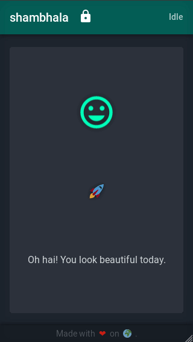

     
    

 

# shambhala

Secure and convenient **transaction signing** for the _stellar network_.

 

     
    

 

## features

* **open** (_architecture_, _design_, _source_ and _API_),
* **mobile-first** (_seriously_),
* **multisignature** (_security cornerstone_),
* **modern web technologies** (_web storage_, _in-browser cross-origin communication_),
* **strong cryptography** (_scrypt_, _pbkdf2_, _aes_, _salsa_, _poly1305_),

 

## documentation

* 📰 [intro](./doc/01.intro.md)
* 🌈 [user interface](./doc/02.user.interface.md)
* 💻 [api](./doc/03.api.md)
* 🏦 [datatypes](./doc/04.datatypes.md)
* 💡 [rest api](./doc/05.rest.api.md)
* 🔧 [installation](./doc/06.install.md)

 

## license

**shambhala** is released under the Apache License, Version 2.0. See the
[LICENSE](./LICENSE) for more details.
