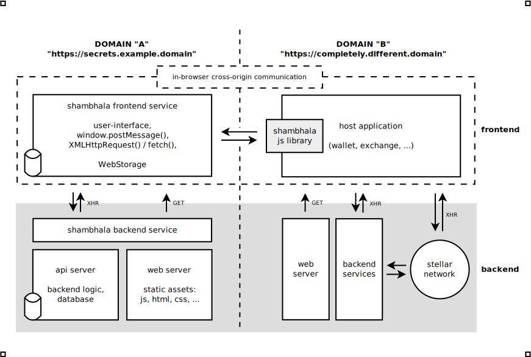

# Index

* [Preface](#preface)
* [Actors](#actors)
* [Architecture overview](#architecture-overview)
* [Fundamental Operations](#fundamental-operations)
    - [Crypto-related operations](#crypto-related-operations)
    - [Transaction-related operations](#transaction-related-operations)
* [Data units](#data-units)
* [Onboarding process](#onboarding-process)
    - [Initial state](#1-initial-state)
    - [Onboarding with an account creation](#2-variant-a---onboarding-with-an-account-creation)
    - [Onboarding with existing account association](#3-variant-b---onboarding-with-existing-account-association)
    - [Signing keys generation, encryption and storage](#4-signing-keys-generation-encryption-and-storage)
    - [Actual state](#5-actual-state)
    - [Automatic keys association](#6-variant-a---automatic-keys-association)
    - [Manual keys association](#7-variant-b---manual-keys-association)
* [Transaction signing process](#transaction-signing-process)
    - [Signing flow](#signing-flow)
    - [Initial state](#1-initial-state-1)
    - [Transaction verification](#2-transaction-verification)
    - [Transaction signing](#3-transaction-signing)
* [Offboarding process](#offboarding-process-idea)
* [Notes](#notes)


<br />
<br />
<br />


# Preface

[**Shambhala**][shambhala] is a convenient and secure
_transaction-signing service_ based on:

- [Multisignature][multisig]
- [Symmetric encryption][symenc]
- [Web Storage]
- In-browser [cross-origin communication][coc]


_**User**_ is the only owner of the `MASTER MNEMONIC` with an optional
`PASSPHRASE` (see [BIP-0039][bip39]) and thus effectively is
**the only owner** of the `MASTER PRIVATE KEY` to the account.
The _**user**_ is, therefore, **the one and only entity in full control
of such account**.


Opting-out of _shambhala service_ is strictly up to the _**user**_ and
cannot be prevented.


[Transaction XDR][transaction] and [signatures][signature] exchange is done
using in-browser [cross-origin communication][coc] preventing most of
the threats listed in [Security Best Practices][sep07sec] chapter
of [SEP-0007][sep07].


Variants of onboarding / modes of operation:

* **[Variant A]** - provides full and secure key management solution.
    Generates `"MASTER" MNEMONIC` for a _**user**_ and allows
    him/her to choose a `PASSPHRASE`. Typical cases include:

    - no previous experience with the _[stellar]_ ecosystem
    - no account entry on the _[stellar]_ ledger
    - no ownership of private key(s) for the _[stellar]_ account(s)
    - rudimentary/no knowledge about general [crypto][cryptography]

* **[Variant B]** - assumes that _**user**_ possesses means of generating
    a valid signature that can be attached to a transaction, which should be
    then successfuly validated by the _[stellar] network_. Account has to have
    a minimum reserve for data subentries as well as operation costs.
    Valid signature allows for full, secure key management for the account
    the user is claiming. Typical cases include:

    - user has previously generated a valid public/private keypair
        for _[stellar] network_ and has created account with enough funds
    - user owns a secure element keyring (also known as the
        _["hardware wallet"][hardware_wallet]_ i.e. _[LedgerHQ]_) and can sign
        a transaction on the _[stellar] network_
    - user possesses some knowledge about cryptography, _[stellar]_ ecosystem
        and can manage signing of transactions externally by any means

<br />
<br />
<br />


# Actors

* _**[user][user_computing]**_ - [👨👩] - A human interacting with the system.


* _**[host application][host_app_dir]**_ - [💻] - Any application
    that operates on / interacts with the _[stellar] network_ and needs
    a robust [transaction] signing mechanism, e.g. _wallet_ or _exchange_.


* _**[client][client_app_dir]**_ - [🎭] - _Shambhala frontend service_
    interacting with the _**[user][user_computing]**_,
    _**[host application][host_app_dir]**_ and _**[server][server_app_dir]**_.
    Responsible for storing data in [Web Storage], key derivation,
    encryption/dectyption of secrets and, most importantly,
    inspecting and signing transactions.


* _**[server][server_app_dir]**_ - [🏢] - _Shambhala backend service_
    interacting with the _**[client][client_app_dir]**_. Responsible for
    storing data in database, key validation, encryption/decryption of secrets,
    checking permissions, checking constraints and signing transactions.

<br />
<br />
<br />


# Architecture overview



<br />
<br />
<br />


# Fundamental operations

Current set of fundamental operations is build on top of:

* [cryptops][cryptopslib] library:
    - [Stanford Javascript Crypto Library][sjcl]
    - _node.js_ [crypto][node_crypto] module and [crypto-browserify][cr_br] implementation
    - [Tweet NaCl JavaScript][tweetnacl_js] library
    - [scrypt js][scrypt_js] library
* [stellar JavaScript SDK][js_stellar_sdk]
* [redshift][redshiftlib] library

<br />


## Crypto-related operations

> For current implementation please refer to [cryptops.js][cryptops].

* generation of a random value which can be used
    as a [salt], [nonce] or [pepper]:

    ```javascript
    // random 256-bit value
    const salt32 = () => { ... }

    // random 512-bit value
    const salt64 = () => { ... }
    ```


* [password-based key-derivation][key_derivation]:

    ```javascript
    // pbkdf2, not too many iterations, 256-bit output
    const genKey = (pass, salt32) => { ... }

    // scrypt, 2^16 iterations, 512-bit output
    const deriveKey = (pass, salt64) => { ... }
    ```


* [symmetric][sym_key] [encryption]:

    ```javascript
    // two round xsalsa20-poly1305/aes encryption,
    // key composed of two 256-bit keys
    const encrypt = (key, secret) => { ... }
    ```


* [symmetric][sym_key] decryption:

    ```javascript
    // two round aes/xsalsa20-poly1305 decryption,
    // key composed of two 256-bit keys
    const decrypt = (key, ciphertext) => { ... }
    ```


* generation of 128-bit [Universally Unique Identifier]:

    ```javascript
    // monotonic, 128-bit value:
    //     - 48 bits of miliseconds since epoch
    //     - 32 bits of truncated `sha256` sum of userAgent string
    //     - 48 random bits
    const genUUID = () => { ... }
    ```

<br />


## Transaction-related operations

> For current implementation please refer to [txops.js][txops].

* [transaction] inspection:

    ```javascript
    // decode relevant information from a given
    // `TransactionSignaturePayload` XDR
    const inspectTSP = (tspXDR) => { ... }
    ```


* [transaction] signing:

    ```javascript
    // sign given `TransactionSignaturePayload` XDR using provided
    // _stellar_ secret key and produce valid signature
    const signTSP = (secret, tspXDR) => { ... }
    ```

<br />
<br />
<br />


# Data units

* `account id` - related:
    - `KEYPAIR` - _StellarSDK.Keypair_ object
    - `PASSPHRASE` - up to 100 characters long, alphanumeric word
    - `G_MNEMONIC` - _genesis_ 24 word `MASTER MNEMONIC` with an optional
        `PASSPHRASE`, stored by _**user**_ (in a form of e.g. [paper wallet])
        and **known only to him/her**
    - `G_PUBLIC` - _**user**_ account number, stellar public key (G...),
        derived from `G_MNEMONIC`
    - `GKP` - _genesis_ `KEYPAIR`, derived from `G_MNEMONIC`,
        comprised of `G_PUBLIC` and `"MASTER" PRIVATE KEY`

* `client side` - related:
    - `C_SECRET` - _**client**_ secret, stellar private key (S...)
    - `C_PUBLIC` - _**client**_ public key (G...)
    - `CKP` - _**client**_ `KEYPAIR`, (`C_PUBLIC` and `C_SECRET`)
    - `SALT` - random 512-bit value, generated using [CSPRNG],
        stored using [Web Storage]
    - `C_UUID` - client's [Universally Unique Identifier],
        stored using [Web Storage]
    - `PIN` - minimum 5-digits secret (alphanumeric as option) - **known only by user**
    - `C_PASSPHRASE` - [passphrase][crypto_passphrase] derived
        from `S_KEY` and `PEPPER`
    - `C_KEY` - [key][crypto_key] derived from `C_PASSPHRASE` and `SALT`,
        used to encrypt/decrypt `ENC_CKP`
    - `ENC_CKP` - `C_SECRET` encrypted using `C_KEY`, stored using [Web Storage]

* `server side` - related:
    - `S_SECRET` - _**server**_ secret, stellar private key (S...)
    - `S_PUBLIC` - _**server**_ public key (G...)
    - `SKP` - _**server**_ `KEYPAIR`, (`S_PUBLIC` and `S_SECRET`)
    - `S_KEY` - [key][crypto_key] derived from `PIN` and `SALT`,
        used to encrypt/decrypt `ENC_SKP`
    - `PEPPER` - random 256-bit value, generated using [CSPRNG],
        not stored anywhere in a plain form
    - `ENC_SKP` - (`[PEPPER, S_SECRET]`) encrypted with `S_KEY`,
            stored on _**server**_

* `transaction` - related:
    - `TX_PAYLOAD` - _TransactionSignaturePayload_ [XDR] (as defined in
        [StelarSDK][js_stellar_sdk])
    - `C_SIGNATURE` - `TX_PAYLOAD` signed with `CKP`
    - `S_SIGNATURE` - `TX_PAYLOAD` signed with `SKP`

<br />
<br />
<br />


# Onboarding process

<br />


## 1. Initial state

* _**client**_ - [🎭]:

    ```javascript
    let clientData = {
        G_PUBLIC: null,
        C_UUID: null,
        C_PUBLIC: null,
        S_PUBLIC: null,
        SALT: null,
        ENC_CKP: null
    }
    ```


* _**server**_ - [🏢]:

    ```javascript
    let serverData = {
        G_PUBLIC: null,
        C_UUID: null,
        S_PUBLIC: null,
        ENC_SKP: null
    }
    ```

<br />


## 2. **[Variant A]** - Onboarding with an account creation

> For current implementation please refer to
> [client/generate_address.js][client_genaddress]
> and [server/generate_address.js][server_genaddress].


* _**user**_ - [👨👩]:

    - doesn't have an account on the _[stellar] network_
    - initiated the process from within a _**host application**_


* _**host application**_ - [💻]:

    ```javascript
    const shambhala = new Shambhala(...)
    let G_PUBLIC = await shambhala.generateAddress()
    ```


* _**client**_ - [🎭]:

    - [笶余 - generate `G_MNEMONIC` and present it to the _**user**_:

        ```javascript
        let G_MNEMONIC = redshift.genMnemonic()
        ```

    - ask _**user**_ to create `PASSPHRASE` (can be empty)

    - [笶余 - create `GKP` (_path 0_):

        ```javascript
        let GKP = func.compose(
            redshift.genKeypair,
            redshift.mnemonicToSeedHex
        )(G_MNEMONIC, PASSPHRASE)
        ```

    - [💥] - destroy `G_MNEMONIC` and `PASSPHRASE`

    - extract `G_PUBLIC`, store it and send it to the _**server**_:

        ```javascript
        let G_PUBLIC = GKP.publicKey()
        ```

    - generate `C_UUID`, store it and send it to the _**server**_:

        ```javascript
        let C_UUID = cryptops.genUUID()
        ```

    - confirm account creation to the _**host application**_ by passing
        extracted `G_PUBLIC`


* _**server**_ - [🏢]:

    - receive `G_PUBLIC` and `C_UUID` from the _**client**_ and store them


* _**host application**_ - [💻]:

    - ask _[sfox service]_ (_friendbot_ on _[test net]_) to fund `G_PUBLIC`
        with minimal amount of XLM, required to perform appropriate _[setOptions]_
        operation that adds two new [ed25519] keys as signers. The number of
        account subentries will increase by two. The minimal required amount of
        XLM will be kept as the _[minimum account balance]_
        required by these subentries.

<br />


## 3. **[Variant B]** - Onboarding with existing account association

> For current implementation please refer to
> [client/associate_address.js][client_assocaddress]
> and [server/associate_address.js][server_assocaddress].

* _**user**_ - [👨👩]:

    - already has a _[stellar] network_ account with funds
    - initiated the process from within a _**host application**_


* _**host application**_ - [💻]:

    ```javascript
    let shambhala = new Shambhala(...)
    await shambhala.associateAddress("GDVKSJYZ...")
    ```


* _**client**_ - [🎭]:

    - receive `G_PUBLIC` from a _**host application**_

    - validate checksum of the received `G_PUBLIC`:

        ```javascript
        StellarSDK.Keypair.fromPublicKey(G_PUBLIC)
        ```

    - present `G_PUBLIC` to the _**user**_ and ask for confirmation

    - generate `C_UUID`, store it and send it to the _**server**_:

        ```javascript
        let C_UUID = cryptops.genUUID()
        ```

    - store `G_PUBLIC` and send it to the _**server**_


* _**server**_ - [🏢]:

    - receive `G_PUBLIC` and `C_UUID` from the _**client**_ and store them

<br />


## 4. Signing keys generation, encryption and storage

> For current implementation please refer to
> [client/generate_signing_keys.js][client_gsk]
> and [server/generate_signing_keys.js][server_gsk].

* _**user**_ - [👨👩]:

    - already has a _[stellar] network_ account with funds
        and has associated it with _Shambhala service_
        (has done **step 2.** or **step 3.** described above)


* _**host application**_ - [💻]:

    ```javascript
    await shambhala.generateSigningKeys("GDVKSJYZ...")
    ```


* _**client**_ - [🎭]:

    - validate received `G_PUBLIC` from _**host application**_ and check
        if it has been associated with _shambhala service_

    - generate and store `SALT`:

        ```javascript
        let SALT = cryptops.salt64()
        ```

    -  ask _**user**_ to provide `PIN` (should be double-checked
        by a two independent input fields)

    - compute `S_KEY`:

        ```javascript
        let S_KEY = await cryptops.deriveKey(PIN, SALT)
        ```

    - send `S_KEY` to the _**server**_

    - [💥] - destroy `PIN` and `S_KEY`


* _**server**_ - [🏢]:

    - receive `S_KEY` from the _**client**_

    - generate `S_SECRET`:

        ```javascript
        let S_SECRET = StellarSDK.Keypair.random().secret()
        ```

    - extract `S_PUBLIC` from `S_SECRET` and store it:

        ```javascript
        let S_PUBLIC = StellarSDK.Keypair.fromSecret(S_SECRET).publicKey()
        ```

    - generate `PEPPER`:

        ```javascript
        let PEPPER = cryptops.salt32()
        ```

    - compute and store `ENC_SKP`:

        ```javascript
        let ENC_SKP = cryptops.encrypt(S_KEY, [PEPPER, S_SECRET])
        ```

    - compute `C_PASSPHRASE`:

        ```javascript
        let C_PASSPHRASE = cryptops.genKey(S_KEY, PEPPER)
        ```

    - send `C_PASSPHRASE` and `S_PUBLIC` to the _**client**_

    - [💥] - destroy `S_KEY`, `S_SECRET`, `PEPPER` and `C_PASSPHRASE`


* _**client**_ - [🎭]:

    - receive `C_PASSPHRASE` and `S_PUBLIC` from the _**server**_

    - store `S_PUBLIC`

    - compute `C_KEY`:

        ```javascript
        let C_KEY = cryptops.deriveKey(C_PASSPHRASE, SALT)
        ```

    - generate `C_SECRET`:

        ```javascript
        let C_SECRET = StellarSDK.Keypair.random().secret()
        ```

    - compute and store `ENC_CKP`:

        ```javascript
        let ENC_CKP = cryptops.encrypt(C_KEY, C_SECRET)
        ```

    - extract `C_PUBLIC` from `C_SECRET` and store it:

        ```javascript
        let C_PUBLIC = StellarSDK.Keypair.fromSecret(C_SECRET).publicKey()
        ```

    - [💥] - destroy `C_PASSPHRASE`, `C_KEY`, `C_SECRET`

    - respond to the _**host application**_ with `[C_PUBLIC, S_PUBLIC]`

<br />


## 5. Actual state

* _**user**_ - [👨👩]:

    - know his/her `G_MNEMONIC` and an optional `PASSPHRASE`
    - know his/her `PIN`
    - know his/her account public address - `G_PUBLIC`
    - is aware that `C_PUBLIC`, `S_PUBLIC` and corresponding
        `C_SECRET` and `S_SECRET` have been created


* _**host application**_ - [💻]:

    - has `G_PUBLIC`, `C_PUBLIC` and `S_PUBLIC`
    - `G_PUBLIC` is created (account exists on the network)
        and has minimum required balance


* _**client**_ - [🎭]:

    ```javascript
    let clientData = {
        G_PUBLIC: "GDVKSJYZ...",
        C_UUID: "01663f03...",
        C_PUBLIC: "GDNQLOS2...",
        S_PUBLIC: "GASVBIEZ...",
        SALT: "1f93a39461e87f2320071ad38362685...",
        ENC_CKP: "2rAAAey7/PNEaPpKNG8BtEZZOXFGaXLPDG..."
    }
    ```


* _**server**_ - [🏢]:

    ```javascript
    let serverData = {
        G_PUBLIC: "GDVKSJYZ...",
        C_UUID: "01663f03...",
        S_PUBLIC: "GASVBIEZ...",
        ENC_SKP: "AWY/D5eKB9FxqqS/wt8XDgfDy..."
    }
    ```

<br />


## 6. **[Variant A]** - Automatic keys association

> For current implementation please refer to
> [client/generate_signed_key_assoc_tx.js][gska_tx].

* _**host application**_ - [💻]:

    - has `G_PUBLIC`, `C_PUBLIC` and `S_PUBLIC`

    - _shambhala_ is asked to generate **signed**
        [transaction][sdk_transaction] allowing `S_PUBLIC` and `C_PUBLIC`
        to sign on behalf of `G_PUBLIC`:

        ```javascript
        await shambhala.generateSignedKeyAssocTX(G_PUBLIC)
        ```


* _**client**_ - [🎭]:

    - [笶余 - `GKP` is present in memory (_NOT_ in the persistent storage),
        as it was created in **onboarding with an account creation**.

    - `G_PUBLIC`, `C_PUBLIC` and `S_PUBLIC` are present in memory

    - construct [StellarSDK.Transaction][sdk_transaction] with an appropriate
        _[setOptions]_ operation:

        - `G_PUBLIC`, `C_PUBLIC`, `S_PUBLIC` _weights_
        - appropriate tresholds
        - `C_PUBLIC` and `S_PUBLIC` allowed for [multisig] on `G_PUBLIC`

    - [笶余 - sign the [transaction][sdk_transaction] with `GKP`

    - [💥] - destroy `GKP`

    - return signed [transaction][sdk_transaction] to a _**host application**_


* _**host application**_ - [💻]:

    - send transaction to the _[stellar] network_

<br />


## 7. **[Variant B]** - Manual keys association

> For current implementation please refer to
> [client/generate_key_assoc_tx.js][gka_tx].

* _**host application**_ - [💻]:

    - has `G_PUBLIC`, `C_PUBLIC` and `S_PUBLIC`

    - _shambhala_ is asked to generate [transaction][sdk_transaction] allowing
        `S_PUBLIC` and `C_PUBLIC` to sign on behalf of `G_PUBLIC`:

        ```javascript
        await shambhala.generateKeyAssocTX(G_PUBLIC)
        ```


* _**client**_ - [🎭]:

    - `G_PUBLIC`, `C_PUBLIC` and `S_PUBLIC` are present in memory

    - construct [StellarSDK.Transaction][sdk_transaction] with an appropriate
        _[setOptions]_ operation:

        - `G_PUBLIC`, `C_PUBLIC`, `S_PUBLIC` _weights_
        - appropriate tresholds
        - `C_PUBLIC` and `S_PUBLIC` allowed for [multisig] on `G_PUBLIC`

    - present `TX_PAYLOAD` to the _**user**_

    - return created [transaction][sdk_transaction]
        to the _**host application**_


* _**host application**_ - [💻]:

    - receive `TX_PAYLOAD` from _shambhala service_

    - if _**user**_ has [LedgerHQ], let him sign the transaction with it
        and send the signed transaction to the _[stellar] network_

    - (alternatively): redirect to appropriate place in [Stellar Laboratory]


* _**user**_ - [👨👩]:

    - use computed `TX_PAYLOAD`, verify it, sign and send
        to the _[stellar] network_ (with the usage of [LedgerHQ] and/or
        [Stellar Laboratory])

<br />
<br />
<br />


# Transaction signing process

<br />


## Signing flow


<br />


## 1. Initial state

* _**user**_ - [👨👩]:

    - know his/her `PIN`
    - has already associated `C_PUBLIC` and `S_PUBLIC`
        to his/her account during the process of onboarding


* _**client**_ - [🎭]:

    ```javascript
    let clientData = {
        G_PUBLIC: "GDVKSJYZ...",
        C_UUID: "01663f03...",
        C_PUBLIC: "GDNQLOS2...",
        S_PUBLIC: "GASVBIEZ...",
        SALT: "1f93a39461e87f2320071ad38362685...",
        ENC_CKP: "2rAAAey7/PNEaPpKNG8BtEZZOXFGaXLPDG..."
    }
    ```


* _**server**_ - [🏢]:

    ```javascript
    let serverData = {
        G_PUBLIC: "GDVKSJYZ...",
        C_UUID: "01663f03...",
        S_PUBLIC: "GASVBIEZ...",
        ENC_SKP: "AWY/D5eKB9FxqqS/wt8XDgfDy..."
    }
    ```

<br />


## 2. Transaction verification

* _**host application**_ - [💻]:

    - request transaction signing:

        ```javascript
        await shambhala.signTransaction(G_PUBLIC, TX_PAYLOAD)
        ```


* _**client**_ - [🎭]:

    - decode `TX_PAYLOAD` received from a _**host application**_
        and present it to the _**user**_:

        ```javascript
        return txops.inspectTSP(TX_PAYLOAD)
        ```

        - source account identifier
        - transaction fee
        - sequence number
        - time bounds
        - memo
        - operations

<br />


## 3. Transaction signing

> For current implementation please refer to
> [client/sign_transaction.js][client_signtransaction]
> and [server/sign_transaction.js][server_signtransaction].

* _**client**_ - [🎭]:

    - ask _**user**_ to provide a `PIN`

    - compute `S_KEY`:

        ```javascript
        let S_KEY = cryptops.deriveKey(PIN, SALT)
        ```

    - send `S_KEY` and `TX_PAYLOAD` to the _**server**_

    - [💥] - destroy `PIN` and `S_KEY`


* _**server**_ - [🏢]:

    - receive `S_KEY` and `TX_PAYLOAD` from the _**client**_

    - extract `S_SECRET` and `PEPPER` by decrypting `ENC_SKP`:

        ```javascript
        let [PEPPER, S_SECRET] = cryptops.decrypt(S_KEY, ENC_SKP)
        ```

    - if the extraction has failed it means that received `S_KEY` is invalid,
        so potential data breach occured on the _**client**_ side or simply
        _**user**_ made a typo in `KEY`. In such scenario next steps
        are impossible, so the procedure has to be aborted,
        _failure counter_ has to be increased and the _**client**_ has
        to be notified. Security precautions can be implemented in this step,
        for example after `3` failed attempts communication with this
        _**client**_ should be suspended for a longer period of time, etc.

    - generate `SKP`:

        ```javascript
        let SKP = StellarSDK.Keypair.fromSecret(S_SECRET)
        ```

    - compute `S_SIGNATURE` by singing `TX_PAYLOAD` with `SKP`:

        ```javascript
        let S_SIGNATURE = txops.signTSB(SKP, TX_PAYLOAD)
        ```

    - [💥] - destroy `SKP` and `S_SECRET`

    - compute `C_PASSPHRASE`:

        ```javascript
        let C_PASSPHRASE = cryptops.genKey(S_KEY, PEPPER)
        ```

    - send `C_PASSPHRASE` and `S_SIGNATURE` to the _**client**_

    - [💥] - destroy `S_KEY`, `PEPPER`, `C_PASSPHRASE`


* _**client**_ - [🎭]:

    - receive `C_PASSPHRASE` and `S_SIGNATURE` from the _**server**_

    - compute `C_KEY`:

        ```javascript
        let C_KEY = cryptops.deriveKey(C_PASSPHRASE, SALT)
        ```

    - extract `C_SECRET` by decrypting `ENC_CKP`:

        ```javascript
        let C_SECRET = cryptops.decrypt(C_KEY, ENC_CKP)
        ```

    - generate `CKP`:

        ```javascript
        let CKP = StellarSDK.Keypair.fromSecret(C_SECRET)
        ```

    - compute `C_SIGNATURE` by singing `TX_PAYLOAD` with `CKP`:

        ```javascript
         let C_SIGNATURE = txops.signTSB(CKP, TX_PAYLOAD)
         ```

    - [💥] - destroy `CKP`, `C_SECRET`, `C_PASSPHRASE` and `C_KEY`

    - send `S_SIGNATURE` and `C_SIGNATURE` to the _**host application**_


* _**host application**_ - [💻]:

    - attach received signatured to constructed transaction

    - send the signed transaction to the _[stellar] network_

<br />
<br />
<br />


# Offboarding process _(idea)_

* _**User**_ uses his/her `G_MNEMONIC` with `PASSPHRASE` to generate `GKP`
  and dissociate (with an appropriate _[setOptions]_ operation) `C_PUBLIC`
  and `S_PUBLIC` keys from his/her account.


* _**User**_ demands from _shambhala_ (by calling appropriate API function)
  to delete `ENC_CKP` and `ENC_SKP` structures.


* _Shambhala_ checks `signers` array on a `G_PUBLIC` account and if there are
  no `C_PUBLIC` and `S_PUBLIC` signers, then `ENC_CKP` and `ENC_SKP` can
  be safely deleted.

<br />
<br />
<br />


# Notes

* There's no way to enforce garbage collect process / shredding of
    memory remains in JavaScript. All places marked with [💥] are currently
    hard (unknown) to achieve in a JavaScript environment.


* After onboarding it is desirable to turn off the phone / computer
    for at least 30 (??) seconds to wipe out DRAM.


* Steps marked with [笶余 in the onboarding process are fragile from
    the security point of view. They are related to very sensitive
    areas - generation of `G_MNEMONIC`, access to and usage of `GKP` and
    `"MASTER" PRIVATE KEY`.


* There is always a tradeoff between security and convenience. Also,
    the more convenient a solution is (in the sense, that an _**user**_ is not
    neccesarily an expert in a given field), the more chance there is
    that some degree of trust to a third party has to be calculated in.


* Safety of a described scheme is build on a following foundations:

    - all communication between _**host application**_ and _**client**_
        is done within browser and using [cross-origin communication][coc] methods
    - all communication betwen _**client**_ and _**server**_ is done
        over [HTTPS]
    - there are two equally important keypairs (`CKP` and `SKP`), both
        stored in an encrypted form (`ENC_CKP` and `ENC_SKP` respectively)
    - _secret keys_ of both `CKP` and `SKP` are never leaving their
        environments (that is [Web Storage] in case of `CKP` and server-side
        database in case of `SKP`)
    - _**user**_ **knows** `PIN` and **has** `SALT`, which are the two
        neccessary ingredients to derive `S_KEY` needed to decrypt `SKP`,
        so in case of server-side database breach `SKP` is safe
    - decryption of `CKP` depends on _**user**_ **knowledge** (`PIN`) and,
        amongs other things, on element stored in **encrypted form** on server
        (`PEPPER`), so in case of client-side storage breach `CKP` is safe
    - if _**user**_ will loose a device with stored `CKP` or forget a `PIN` or
        simply want to cancel using _shambhala transaction-signing scheme_,
        his/her funds on the _[stellar] network_ are safe, because he/she
        **knows** `G_MNEMONIC` with `PASSPHRASE` from which the **master key**
        can be derived
    - the same apply to the situation in which eventual server-side data loss
        occurs - **master key** is in the posession of a _**user**_, so funds
        on the _[stellar] account_ are safe and accessible


* Strong emphasis has to be put on all security considerations related to
    onboarding process in **[Variant A]**.


[shambhala]: https://en.wikipedia.org/wiki/Shambhala
[multisig]: https://www.stellar.org/developers/guides/concepts/multi-sig.html
[symenc]: https://en.wikipedia.org/wiki/Symmetric-key_algorithm
[coc]: https://developer.mozilla.org/en-US/docs/Web/API/Window/postMessage
[HTTPS]: https://en.wikipedia.org/wiki/HTTPS
[bip39]: https://github.com/bitcoin/bips/blob/master/bip-0039.mediawiki
[sep07]: https://github.com/stellar/stellar-protocol/blob/master/ecosystem/sep-0007.md
[signature]: https://www.stellar.org/developers/guides/get-started/transactions.html#send-payments
[sep07sec]: https://github.com/stellar/stellar-protocol/blob/master/ecosystem/sep-0007.md#security-best-practices-for-compliance-with-this-sep
[stellar]: https://www.stellar.org/
[cryptography]: https://en.wikipedia.org/wiki/Cryptography
[hardware_wallet]: https://en.wikipedia.org/wiki/Cryptocurrency_wallet#Hardware_wallet
[LedgerHQ]: https://www.ledger.fr/
[sjcl]: https://bitwiseshiftleft.github.io/sjcl/
[node_crypto]: https://nodejs.org/api/crypto.html
[tweetnacl_js]: https://tweetnacl.js.org/
[scrypt_js]: https://www.npmjs.com/package/scrypt-js
[cr_br]: https://github.com/crypto-browserify/crypto-browserify
[js_stellar_sdk]: https://stellar.github.io/js-stellar-sdk/
[redshiftlib]: https://www.npmjs.com/package/@stellar-fox/redshift
[cryptopslib]: https://www.npmjs.com/package/@stellar-fox/cryptops
[cryptops]: https://github.com/stellar-fox/cryptops/blob/master/src/index.js
[txops]: ../src/lib/txops.js
[client_genaddress]: ../src/client/actions/generate_address.js
[server_genaddress]: ../src/server/actions/generate_address.js
[client_assocaddress]: ../src/client/actions/associate_address.js
[server_assocaddress]: ../src/server/actions/associate_address.js
[client_gsk]: ../src/client/actions/generate_signing_keys.js
[server_gsk]: ../src/server/actions/generate_signing_keys.js
[gska_tx]: ../src/client/actions/generate_signed_key_assoc_tx.js
[gka_tx]: ../src/client/actions/generate_key_assoc_tx.js
[client_signtransaction]: ../src/client/actions/sign_transaction.js
[server_signtransaction]: ../src/server/actions/sign_transaction.js
[user_computing]: https://en.wikipedia.org/wiki/User_(computing)
[host_app_dir]: ../src/host/
[client_app_dir]: ../src/client/
[server_app_dir]: ../src/server/
[salt]: https://en.wikipedia.org/wiki/Salt_(cryptography)
[nonce]: https://en.wikipedia.org/wiki/Cryptographic_nonce
[pepper]: https://en.wikipedia.org/wiki/Pepper_(cryptography)
[paper wallet]: https://en.bitcoin.it/wiki/Paper_wallet
[key_derivation]: https://en.wikipedia.org/wiki/Key_derivation_function
[encryption]: https://en.wikipedia.org/wiki/Encryption
[sym_key]: https://en.wikipedia.org/wiki/Symmetric-key_algorithm
[Universally Unique Identifier]: https://en.wikipedia.org/wiki/Universally_unique_identifier
[transaction]: https://www.stellar.org/developers/guides/concepts/transactions.html
[sdk_transaction]: https://stellar.github.io/js-stellar-sdk/Transaction.html
[CSPRNG]: https://en.wikipedia.org/wiki/Cryptographically_secure_pseudorandom_number_generator
[Web Storage]: https://developer.mozilla.org/en-US/docs/Web/API/Web_Storage_API
[crypto_key]: https://en.wikipedia.org/wiki/Key_(cryptography)
[XDR]: https://www.stellar.org/developers/guides/concepts/xdr.html
[crypto_passphrase]: https://en.wikipedia.org/wiki/Passphrase
[Stellar Laboratory]: https://www.stellar.org/laboratory/
[test net]: https://github.com/stellar/docs/blob/master/guides/concepts/test-net.md
[sfox service]: https://github.com/stellar-fox/deneb
[setOptions]: https://stellar.github.io/js-stellar-sdk/Operation.html#.setOptions
[ed25519]: https://ed25519.cr.yp.to/
[minimum account balance]: https://www.stellar.org/developers/guides/concepts/fees.html#minimum-account-balance
