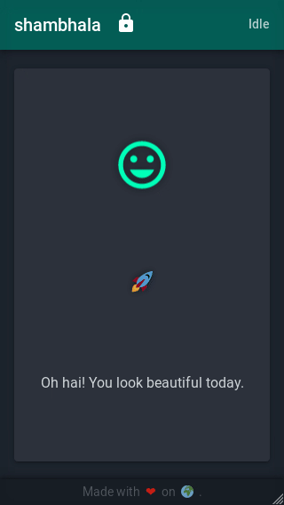

# Index

* [Onboarding with an account creation](#onboarding-with-an-account-creation)
* [Onboarding with an account association](#onboarding-with-an-account-association)
* [Transaction signing](#transaction-signing)

 
 
 

# Onboarding with an account creation

     
    

## Control flow

* [account creation](./01.intro.md#2-variant-a---onboarding-with-an-account-creation)
* [keys generation](./01.intro.md#4-signing-keys-generation-encryption-and-storage)

 
 
 

# Onboarding with an account association

     
    

## Control flow

* [account association](./01.intro.md#3-variant-b---onboarding-with-existing-account-association)
* [keys generation](./01.intro.md#4-signing-keys-generation-encryption-and-storage)

 
 
 

# Transaction signing

     
    

## Control flow

* [transaction signing](./01.intro.md#transaction-signing-process)
